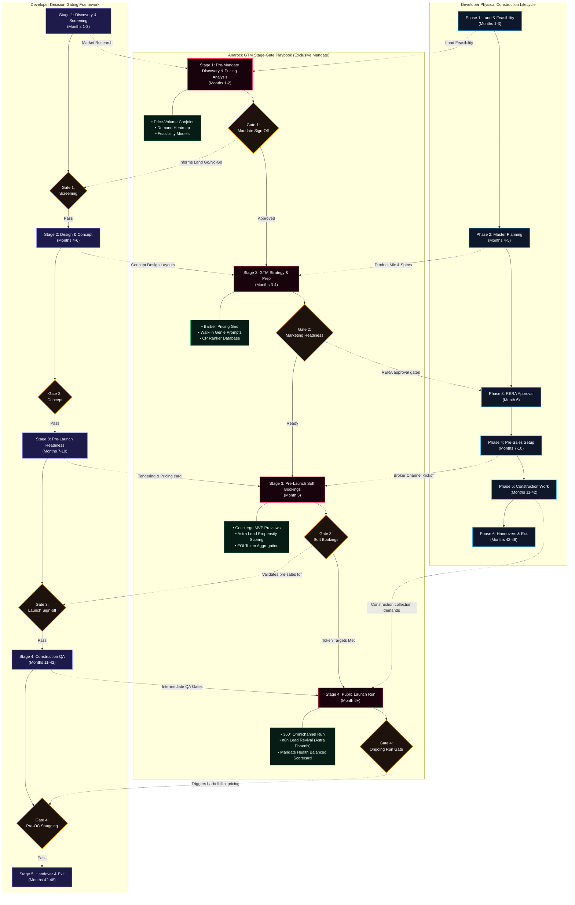

# Anarock GTM Stage-Gate Playbook: Developer Lifecycle Mapping

This document maps the marketing, sales, and launch velocity activities of the **Anarock GTM Stage-Gate Playbook** onto generic developer-level project lifecycles. It aligns commercial launch activities with physical construction and real estate development milestones.

---

## 1. Executive Summary & Alignment Thesis
Traditional developer-level playbooks focus on **physical design, regulatory approvals, and construction milestones** (e.g., land due diligence, shell excavation, slab casting, and occupancy certification). 

Conversely, **Anarock’s GTM Stage-Gate Playbook** is an agency-side commercial execution framework. It governs marketing efficiency, pricing architecture, broker activation, and sales velocity under an exclusive mandate. 

By mapping these activities onto a generic developer's physical timelines, we ensure that:
* **Market intelligence** feeds concept design and unit mix configurations before final building plans are frozen.
* **Pre-sales token aggregation** completes in time to satisfy cash flow thresholds required for institutional debt drawdowns.
* **Ongoing sales campaigns** are synchronized with construction collection schedules to optimize financing costs.

---

## 2. Integrated Timeline Alignment Matrix

The following table aligns the lifecycles across a unified project schedule, highlighting the overlapping stages and critical gating milestones:

| Timeframe | Developer Physical Construction | Developer Gating Milestones | Anarock Mandate GTM Playbook | Key Mandate GTM Activities & Deliverables | Decision Gates & Thresholds |
| :--- | :--- | :--- | :--- | :--- | :--- |
| **Months 1–3** | **Phase 1: Land & Feasibility** *Land acquisition, due diligence & base modeling* | **Stage 1: Discovery & Screening** *Zoning analysis, market feasibility screening* | **Stage 1: Pre-Mandate Discovery & Pricing Analysis** *Underwrite mandate margins & local absorption* | • Competitor Price-Volume Conjoint Analysis • Micro-Market Demand Heatmaps • Initial Financial Hurdle Models | **Gate 1: Mandate Sign-Off** • Blended Equity IRR &ge; 20% • Local Overhang &le; 18 months |
| **Months 4–6** | **Phase 2: Planning & Design** *Zoning approvals, master planning & utility planning* | **Stage 2: Design & Concept Approval** *Massing models, architectural concepts & design reviews* | **Stage 2: GTM Strategy & Prep** *Collaterals, pricing splits & agent setup* | • Barbell Pricing Model (Compact Value vs. Premium splits) • Fine-tune Walk-in Genie AI prompts • CP Ranker database alignment | **Gate 2: Marketing Readiness** • RERA Registration active & validated • Pre-Registered CPs &ge; 150 • Site Experience Office 100% |
| **Months 7–10** | **Phase 3: Pre-Sales Setup** *Launch prep, experience office & CP kickoff* | **Stage 3: Pre-Launch Readiness** *Launch checks, pricing approvals, & tenders* | **Stage 3: Pre-Launch Soft Bookings** *Private reviews & early token aggregation* | • Private Concierge MVP walkthroughs • Astra Platinum Lead Propensity scoring • Expression of Interest (EOI) token gathering | **Gate 3: Soft Bookings Gate** • Pre-sales &ge; 15% of Phase 1 • Tokens gathered &ge; ₹12.0 Cr |
| **Months 11–42** | **Phase 4: Structure Construction** *Excavation, core structure & finishing runs* | **Stage 4: Construction & Quality QA** *Superstructure execution & quality audits* | **Stage 4: Public Launch & Run** *Omnichannel sales, client reporting & lead recovery* | • 360° Omnichannel campaign activation • n8n Lead Revival integration (Astra Phoenix) • Developer Mandate Health Balanced Scorecard | **Gate 4: Ongoing Run Gate** • Weekly Sales Velocity &ge; 12/mo • Overall CAC &le; 2.50% |
| **Months 42–48+** | **Phase 5: Handovers & Exit** *Stabilization, key handovers & snagging* | **Stage 5: Project Handover** *OC procurement, customer snagging, FM transition* | **Sustenance Phase & Handover Transition** *Final handovers & mandate wrap-up* | • Final contract inventory cleanup • Mandate performance dashboard audit • Transition dashboard to developer CRM | **Final Exit Review** • Handover NPS &ge; 70 • 100% receivables collected |

---

## 3. Comprehensive Project Lifecycle Flowchart

The flowchart below visualizes how the stages of the **Anarock GTM Playbook** flow horizontally alongside a generic developer's lifecycle, showing the exact dependencies and check gates:

---

## 4. Key Cross-Framework Interdependencies & Sync Points

1. **Pre-Mandate Phase (Months 1–3):**
   * **The Sync:** Strategy research team runs the *Competitor Price-Volume Conjoint Analysis* (Anarock Stage 1) to determine user willingness-to-pay (WTP) for specific smart-home configurations (Developer Stage 1).
   * **The Gating Link:** If the *Financial Hurdle Model* shows a blended IRR below 20.0%, it flags a fail for **Gate 1** of both the screening and Anarock's mandate underwriting, preventing land acquisition/JDA signing.

2. **Concept & Preparation Phase (Months 4–6):**
   * **The Sync:** While the architect files the building plans for regulatory sanctions (Developer Phase 2), Anarock designs the *Barbell Pricing Model*. By offering smaller, highly efficient compact units alongside signature penthouses, the PM locks in the sales velocity layout without degrading overall project gross realization.
   * **The Gating Link:** **Gate 2** requires a validated building plan sanction and an active RERA registration number before the 360° lead-generation engine goes live.

3. **Soft Launch & Token Aggregation (Months 7–10):**
   * **The Sync:** Anarock triggers the private *Concierge MVP Previews* to test the smart-home IoT value proposition on real buyers. Concurrently, the *Astra Platinum* engine scores lead propensity to optimize physical site-visit conversion.
   * **The Gating Link:** Proceeding to full construction and launching public sales campaigns (**Gate 3**) requires a minimum of **₹12.0 Cr** in committed token advances. This cash acts as equity cushioning to unlock the developer's construction finance drawdowns.

4. **Construction & Sustenance Run (Months 11–42):**
   * **The Sync:** As structural columns are cast floor-by-floor (Developer Phase 5 / Stage 4), Anarock manages the sales run-rate. If weekly velocity falls below 12 units or CAC exceeds 2.50%, the *Astra Phoenix* n8n webhook is triggered to automatically revive stalled leads, bypassing expensive paid acquisition.
   * **The Gating Link:** Compliance with **Gate 4** (Pre-Launch Readiness / Handover prep) requires that at least 70% of inventory is booked and collections are running above an 80% collection efficiency threshold to service active debt.
