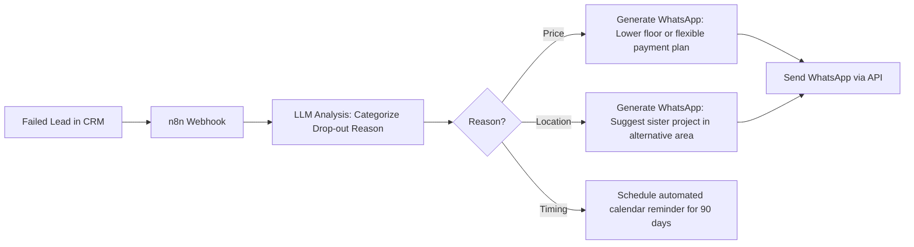
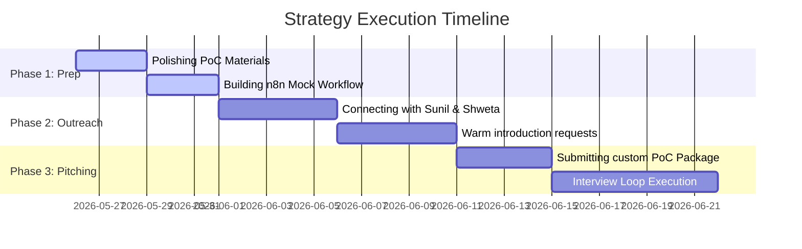

# 🏢 Anarock Business Strategy & Marketing Playbook
## High-Impact Job Capture Strategy: Leveraging ISB Strategy, AI Automation & Financial Rigor

> **Goal:** Position yourself as a premium candidate for the **Business Strategy and Marketing** role at ANAROCK Group. Showcase how you can combine ISB-trained strategic frameworks, automated operations (n8n/AI), and data-driven client engagement to accelerate developer sales velocity and supercharge **Anarock.AI** initiatives.

---

## 📋 TABLE OF CONTENTS
1. [Anarock Company & Services Analysis](#1-anarock-company--services-analysis)
2. [Role Fit & Value Proposition Mapping](#2-role-fit--value-proposition-mapping)
3. [LinkedIn Outreach Targets & Templates](#3-linkedin-outreach-targets--templates)
4. [Proof of Concept (PoC) Strategies (The "Wow" Factor)](#4-proof-of-concept-poc-strategies-the-wow-factor)
5. [30-60-90 Day Job Capture Roadmap](#5-30-60-90-day-job-capture-roadmap)

---

## 1. ANAROCK COMPANY & SERVICES ANALYSIS

ANAROCK is not just a traditional real estate brokerage; it is an **exclusive, tech-enabled sales and marketing execution partner** for real estate developers. To succeed here, you must understand their core business engine.

### A. The Exclusive Mandate Model
*   **How it works:** Under an exclusive mandate, Anarock acts as the complete, outsourced sales and marketing department for a developer's project. They take on the risk and the responsibility of project launch, pricing strategy, GTM execution, and inventory clearance.
*   **The Problem They Solve:** Developers are excellent at land acquisition, regulatory approvals, and construction, but often struggle with lead generation, sales conversion, and digital marketing efficiency. Anarock brings institutional rigor, market data, and sales velocity to the table.
*   **Key Drivers of Mandate Profitability:** 
    *   **Sales Velocity (Units/Month):** Fast inventory clearance maximizes cash flow and developer IRR.
    *   **Customer Acquisition Cost (CAC):** Keeping digital marketing spend low relative to bookings.
    *   **Channel Partner (CP) Mobilization:** Effectively engaging external brokers to drive site visits.

### B. Anarock.AI: The Tech Advantage
Anarock has built a significant competitive advantage over JLL, CBRE, and local brokers by launch of **Anarock.AI**, a proprietary suite of 9 AI-driven tools divided into three core pillars:

```mermaid
graph TD
    subgraph Genie Suite (Generative AI)
        G1[Walk-in Genie - B2C Lead Qualifier]
        G2[CP Genie - B2B Broker Engagement]
        G3[ORM Genie - Reputation Manager]
        G4[Referral Genie - Customer Referrals]
    end
    
    subgraph Astra Suite (Predictive AI)
        A1[Astra Platinum - Lead Scoring & Propensity]
        A2[Astra Phoenix - Failed Lead Revival]
        A3[Astra Hire - Sales Talent Profiling]
        A4[Astra Sales Boost - Sales Performance Coach]
    end
    
    subgraph Partner Management (CP 360)
        C1[CP Ranker - AI CP Matchmaking]
    end
    
    Anarock.AI --> Genie Suite
    Anarock.AI --> Astra Suite
    Anarock.AI --> Partner Management
```

---

## 2. ROLE FIT & VALUE PROPOSITION MAPPING

The **Business Strategy and Marketing** role at Anarock is high-visibility and highly analytical. You sit between the developer client, the digital marketing execution team, and the physical sales team. 

Here is how your background fits perfectly:

| Anarock Mandate Pain Points | Your Skill Set & Experience | Your Specific Proof Points |
| :--- | :--- | :--- |
| **Developer Transparency & Communication**<br>Developers want real-time visibility into sales funnels, marketing ROI, and project milestones. | **Balanced Scorecards & BI Dashboards**<br>Ability to translate complex GTM execution and finance data into highly-scannable executive dashboards. | [Purva BluNex Towers BSC HTML](file:///c:/Users/Meghana%20G%20S/OneDrive/Documents/Business%20Consulting/ISB/Week%2016/Supporting%20Documents/06_Balanced_Scorecard_KPIs.html)<br>Designed complete Financial, Customer, Process, and Growth scorecard with Power BI specs. |
| **GTM Launch Execution & Structuring**<br>Launches are chaotic; delays in GTM activities lead to heavy interest costs and delayed sales. | **Stage-Gate Frameworks & Master Schedules**<br>Structured phase-wise stage-gate gating systems to ensure zero deviations in launch timelines. | [Purva Stage-Gate Guide](file:///c:/Users/Meghana%20G%20S/OneDrive/Documents/Business%20Consulting/ISB/Week%2016/Supporting%20Documents/05_Stage_Gate_Framework.html)<br>Created a multi-gate validation framework specifically mapped to high-value real estate development. |
| **Scaling Anarock.AI Automation**<br>The strategy team needs to operationalize AI features (like Walk-in Genie and CP Ranker) across city teams. | **AI Automation & n8n Integration**<br>Hands-on capabilities in building active AI pipelines, webhooks, and automation chains. | **Active n8n Pipelines**<br>Proven capability building production automation setups using LLMs and CRM APIs. |
| **GTM Strategy & Developer Benchmarking**<br>Developing persuasive pitching strategies to win new mandates from Tier-1 and Tier-2 developers. | **Strategic & Financial Modeling**<br>Analyzing developer financials, margin structures, and product pricing models. | **ISB Capstone Project & Financial Modeling**<br>Thorough understanding of cash flows, project IRR, collection efficiency, and pricing optimization. |

---

## 3. LINKEDIN OUTREACH TARGETS & TEMPLATES

To capture this role, you should skip standard HR screens and target the **owners of the technology, marketing, and strategy functions**.

### 🎯 Key Contacts

1.  **Sunil Mishra**
    *   **Title:** CEO-Growth Businesses and Chief AI & Strategy Officer
    *   **Why Target:** He owns Strategy, Digital Marketing, and Anarock.AI. He is the ultimate decision-maker for this role and will deeply appreciate your combination of strategy and automation.
    *   **LinkedIn Search:** "Sunil Mishra Anarock"
2.  **Shweta Papriwal**
    *   **Title:** Director – Corporate Marketing
    *   **Why Target:** She leads corporate marketing, brand building, and digital marketing strategies.
    *   **LinkedIn Search:** "Shweta Papriwal Anarock"
3.  **Umakanth Yuvarajan**
    *   **Title:** Vice President – Bangalore (Strategic Advisory & Valuations)
    *   **Why Target:** Leads strategy and valuations at the Bangalore regional office. High relevance for city-level roles.
    *   **LinkedIn Search:** "Umakanth Yuvarajan Anarock"
4.  **Sanjay Mishra**
    *   **Title:** Group CHRO
    *   **Why Target:** Leads human resources across the group; useful for formalizing an interview loop once business leadership is hooked.
    *   **LinkedIn Search:** "Sanjay Mishra Anarock CHRO"

---

### 📩 Personalized Outreach Templates (< 300 Characters)

#### Template 1: Target - Sunil Mishra (Chief AI & Strategy Officer)
> **Hi Sunil, I've been studying Anarock.AI's deployment—specifically the CP Ranker and Walk-in Genie models. Combining my ISB strategy training with hands-on n8n automation, I've designed an automated re-engagement pipeline for failed real estate leads. Would love to share the PoC visual and connect!**

#### Template 2: Target - Shweta Papriwal (Director - Corporate Marketing)
> **Hi Shweta, congratulations on your leadership at Anarock! I'm a real estate strategist specializing in bridging GTM execution with deep analytics. I recently built a comprehensive Balanced Scorecard & BI Dashboard framework for developer mandates to track CAC and NPS. Let's connect!**

#### Template 3: Target - Umakanth Yuvarajan (VP - Bangalore Strategy)
> **Hi Umakanth, your advisory work in Bangalore is outstanding. I specialize in applying Stage-Gate execution frameworks and financial modeling to optimize launch velocity in Bangalore's micro-markets (modeled Purva BluNex). Would love to exchange insights and connect!**

---

### 💬 Post-Connection Nudge (With PoC)

Send this within 24 hours of connection acceptance. This replaces passive resumes with **proactive value generation**.

> **Hi [Name],**
>
> **Thanks for connecting! I know how critical lead qualification and client transparency are for Anarock’s developer mandates. Rather than just sharing a resume, I've put together a brief strategy document detailing three Proof of Concepts (PoC) I've designed:**
>
> 1. **An automated n8n pipeline that mimics Astra Phoenix to qualify and revive "cold/failed" homebuyer leads via LLM profiling.**
> 2. **A Client Mandate Performance Dashboard (Balanced Scorecard) that links marketing CAC, sales velocity, and site-visit conversions for developers.**
> 3. **A Stage-Gate GTM Playbook mapped to Bangalore's residential market to guarantee project launch timelines.**
>
> **I’ve compiled these into a brief strategy artifact [here]. Would love to hear if this alignment of strategy, automation, and real estate analytics matches what you're looking for in your Business Strategy & Marketing team!**
>
> **Best regards,**
> **Meghana Grama Satyan**

---

## 4. PROOF OF CONCEPT (PoC) STRATEGIES (THE "WOW" FACTOR)

Instead of just telling them what you can do, **show them**. Prepare a portfolio containing these three hyper-customized PoCs.

### 📊 PoC 1: The "Developer Mandate Health" Balanced Scorecard

We have designed a highly specialized, interactive **"Developer Mandate Health" Balanced Scorecard** tailored for Anarock's corporate and developer-level clients. In exclusive developer mandates, Anarock's core profit drivers are inventory velocity, marketing efficiency, and collection liquidity. This dashboard pivots from generic construction metrics (superstructure schedule SPI, concrete cycles, training hours) to represent a robust client-facing performance management matrix. 

👉 **Interactive Dashboard & Specs:** You can view and interact with the full, responsive strategic asset at: **[Anarock_Developer_Mandate_Scorecard.html](file:///c:/Users/Meghana%20G%20S/OneDrive/Documents/Business%20Consulting/Jobs/Anarock/Anarock_Developer_Mandate_Scorecard.html)**. The file features a fully functional mock **Power BI Dashboard Page Switcher** to cycle through executive overview, partner telemetry, AI funnel tracking, and marketing ROI.

---

#### 📈 The Balanced Scorecard: 4 Client-Facing Perspectives

##### 1. Financial Perspective
*Underwrites base price realizations, installments billing aging, and customer acquisition cost limits.*
* **Blended Revenue Realization (Target: $\ge$ ₹8,700/sft):** Net sales collections divided by sold area. Measures performance of the barbell layout pricing strategy (compact value apartments vs. premium 3 BHKs vs. ultra-luxury penthouses).
  * *Source:* SAP S/4 HANA (GL_Actuals table) | *Frequency:* Monthly | *Owner:* VP Finance
* **Collection Efficiency (Target: $\ge$ 85% on demand):** Installments collected on schedule. Crucial to guarantee construction liquidity and developer IRR stability.
  * *Source:* SAP FICO module (AR_Aging table) | *Frequency:* Monthly | *Owner:* CFO
* **Actual CAC vs. Budgeted Cap (Target: $\le$ 2.5% GTV):** Capping blended digital media buy and broker commissions relative to the Gross Transaction Value of closed sales.
  * *Source:* Salesforce + Marketing Ledger | *Frequency:* Weekly | *Owner:* CMO

##### 2. Customer & Brand Perspective
*Monitors buyer satisfaction levels, physical closing ratios, and sales response velocity.*
* **Brand Net Promoter Score (NPS Target: $\ge$ 70):** Benchmarks customer relationship health post-sales, keeping Anarock aligned with top-tier developers like Sobha (72) and Oberoi (78).
  * *Source:* Post-Interaction Surveys | *Frequency:* Quarterly | *Owner:* CX Head
* **Site-Visit to Booking Conversion (Target: $\ge$ 12%):** Percentage of physical walk-in leads successfully converted into sales by on-site closing teams.
  * *Source:* Salesforce CRM | *Frequency:* Weekly | *Owner:* VP Sales
* **Lead Response Time (Target: $<$ 5 mins):** Average duration between a web form submission and a personal B2C outbound response from an Anarock strategist.
  * *Source:* CRM Activity Timestamp | *Frequency:* Real-Time | *Owner:* Sales Lead

##### 3. Channel Partner (CP) Perspective
*Maximizes broker engagement rates while controlling database concentration and AI profiling risk.*
* **Active CP Mobilization (Target: $\ge$ 200 brokers):** Number of unique external brokers generating at least 1 verified walk-in within a rolling 30-day window.
  * *Source:* CP Portal Ledger | *Frequency:* Monthly | *Owner:* VP CP Relations
* **Top-5% CP Sales Contribution (Target: $\le$ 45%):** Risk mitigation index to limit broker network concentration vulnerability and maintain margin leverage.
  * *Source:* Salesforce Analytics | *Frequency:* Quarterly | *Owner:* VP CP Relations
* **CP Ranker Accuracy Index (Target: $\ge$ 90%):** Success rate of Anarock's **CP Ranker** predictive AI matchmaking engine in identifying brokers with high buyer affinity.
  * *Source:* Anarock.AI Analytics | *Frequency:* Monthly | *Owner:* Product Head

##### 4. Digital Telemetry & AI Funnel Perspective
*Monitors the active yield, qualification, and revival rates of Anarock.AI tools.*
* **Genie AI Lead Qualification Rate (Target: $\ge$ 85%):** Percentage of inbound B2C chats correctly analyzed, profiled, and qualified by the **Walk-in Genie** conversational AI agent.
  * *Source:* Genie Chat Logs | *Frequency:* Daily | *Owner:* CTO
* **Astra Phoenix Lead Revival Rate (Target: $\ge$ 10%):** Lead resurrecting success rate of automated WhatsApp re-outreach pipelines tied to n8n CRM drop-out webhooks.
  * *Source:* n8n CRM Webhooks | *Frequency:* Weekly | *Owner:* CTO
* **WhatsApp Conversational CSAT (Target: $\ge$ 4.0 / 5.0):** User satisfaction scores returned following automated digital chat engagement sessions.
  * *Source:* IoT Survey Table | *Frequency:* Weekly | *Owner:* CX Head

---

#### 🔌 Enterprise Data Integration & Pipeline Architecture
To underwrite developer trust, the scorecard is powered by an active, unified data pipeline that eliminates lag between raw customer interaction and executive reports:

1. **SAP S/4 HANA (Financials):** Dynamically feeds blended collections, billing slabs, and cost-overruns via the SAP BW connector (`GL_Actuals`, `AR_Aging` tables).
2. **Salesforce CRM (Sales Funnel):** Streams real-time walk-in counts, digital form submissions, lead response delays, and broker bookings via REST APIs (`Leads`, `Opportunities` tables).
3. **Anarock.AI Platform (AI Telemetry):** Aggregates qualification logs from Genie, predictive scores from Astra Platinum, and lead resurrection logs from Astra Phoenix n8n pipelines via Azure Event Hubs (`Genie_Chats`, `Astra_Logs` tables).

---

---

### 🤖 PoC 2: AI Lead Revival Pipeline (n8n + LLM Automation)
Build a prototype workflow in **n8n** that demonstrates how Anarock can automate and optimize **Astra Phoenix** or **Walk-in Genie** features. 

#### The Workflow Design:


*   **Why it wows Sunil Mishra:** It shows you don't just speak "AI strategy"—you can actually build, test, and integrate it. It proves you understand their exact tech stack challenges (CRM, API integrations, prompt engineering).

---

### 🏗️ PoC 3: The "Mandate GTM" Stage-Gate Playbook
We have developed a comprehensive, interactive **Stage-Gate GTM Framework** specifically adapted for Anarock's exclusive developer mandates. This framework shifts operational focus from physical construction milestones to GTM sales velocity and marketing yield, leveraging Anarock's proprietary AI suite to compress timelines and reduce developer cash flow risk.

👉 **Interactive Dashboard & Calculator:** You can view and interact with the full, responsive strategic asset at: **[Anarock_GTM_Stage_Gate_Playbook.html](file:///c:/Users/Meghana%20G%20S/OneDrive/Documents/Business%20Consulting/Jobs/Anarock/Anarock_GTM_Stage_Gate_Playbook.html)**. This file contains a live client-side calculator allowing developers to simulate different IRR, CP, pre-sales, and CAC parameters to test Gate compliance.

Below is the structured 2-page Executive Summary of the framework applied to a hypothetical Tier-1 residential launch in Bangalore's tech-belt (Whitefield / Thanisandra corridor, ticket sizes: ₹1.2 Cr – ₹3.5 Cr):

---

#### 📌 Stage 1: Pre-Mandate Discovery & Pricing Analysis
* **Objectives:** Establish market feasibility, baseline absorption velocity, and underwrite the developer's price-volume expectations before committing Anarock's agency resources.
* **Key Deliverables:**
  * **Competitor Price-Volume Conjoint Analysis:** A statistical attribute utility mapping to lock in optimal unit mixes (2 BHK value tier vs. 3 BHK core premium) and blended base price realizations.
  * **Micro-Market Demand Heatmaps:** Data-driven demographic studies analyzing geographic shifts in technology corridor homebuyers.
  * **Financial Hurdle Models:** Baseline debt-service and equity IRR models for the developer's land parcel.
* **Gate 1: Mandate Sign-Off & Feasibility Assessment**
  * **Pass/Exit Hurdle Criteria:**
    * Estimated Project blended equity IRR $\ge 20\%$ at proposed launch ticket pricing.
    * Preliminary developer Expression of Interest (EOI) digital target $\ge 500$ in 6 months.
    * Local micro-market inventory overhang index $\le 18$ months.
  * **Gating Outcome:** Exclusivity terms signed. Authorized to proceed to Stage 2 conceptual design and collateral lock-in.

---

#### 📌 Stage 2: GTM Strategy & Creative Readiness
* **Objectives:** Secure compliance clearances, design creative assets, map broker partnerships, and initialize conversational B2C digital outreach.
* **Key Deliverables:**
  * **Barbell Pricing Architecture:** Formulating a 3-tier product layout (compact 2 BHK value entry-tier to accelerate cash-flow volume + core premium 3 BHK units as the margin generator + signature luxury penthouses).
  * **Anarock.AI Walk-in Genie Prompts:** Training and fine-tuning B2C Generative AI conversational scripts with developer USPs and smart-home automation specs.
  * **Channel Partner (CP) Mobilization Database:** Running predictive broker matching via **CP Ranker** to isolate and align the top 200 active micro-market brokers.
* **Gate 2: Marketing & Creative Readiness**
  * **Pass/Exit Hurdle Criteria:**
    * Official RERA Karnataka Registration Number active and validated.
    * Physical site experience office and high-fidelity creative kit signed-off.
    * $\ge 150$ Channel Partners pre-registered on launch commission terms.
  * **Gating Outcome:** RERA verified, marketing pipelines open. Authorized to run public pre-sales and token campaigns.

---

#### 📌 Stage 3: Pre-Launch Soft Bookings
* **Objectives:** Run exclusive private site-office previews, score incoming buyer profiles, and aggregate a committed pre-sales token corpus.
* **Key Deliverables:**
  * **Concierge MVP Previews:** Hosting private walkthroughs for HNI and pre-qualified buyers to validate base pricing tolerances.
  * **Astra Platinum Lead Propensity Scoring:** Running real-time predictive models on registered leads to focus physical sales teams on highest-converting profiles.
  * **EOI Token Aggregation:** Collecting soft cheques and digital token corpus to feed launching cash flows.
* **Gate 3: Pre-Launch Soft Bookings**
  * **Pass/Exit Hurdle Criteria:**
    * Launch phase pre-sales volume $\ge 15\%$ of phase 1 inventory.
    * High-commitment EOI token corpus gathered $\ge ₹12$ Cr.
    * Astra conversion prediction accuracy index $\ge 85\%$.
  * **Gating Outcome:** Market pricing validated, funding cash flows stabilized. Authorized to trigger public 360-degree digital launch campaigns.

---

#### 📌 Stage 4: Public Launch & Sustenance Velocity
* **Objectives:** Scaling omnichannel digital campaigns, real-time funnel telemetry review, and automated re-engagement of stalled pipelines.
* **Key Deliverables:**
  * **360-Degree Omnichannel Launches:** Activating simultaneous digital performance (Meta/Google), local OOH, and CP networks.
  * **Developer Mandate Health Dashboard:** Delivering Power BI spec dashboard showing real-time digital impressions to site-visit conversions.
  * **n8n Lead-Revival Webhooks:** Connecting lead dropout CRM logs to n8n pipelines, routing "stalled" leads through LLM prompt engines for Whatsapp offers (representing the Astra Phoenix engine).
* **Gate 4: Public Launch & Sustenance Gating**
  * **Pass/Exit Hurdle Criteria:**
    * Weekly Sales Velocity Index (SVI) maintained $\ge 12$ units/month.
    * Overall Customer Acquisition Cost (CAC) maintained below $2.5\%$ of gross transaction value (GTV).
    * Astra Phoenix lead re-activation success rate $\ge 10\%$.
  * **Gating Outcome (Continuous Run):** If CAC spikes above 2.5% or velocity falls, the playbook triggers automated pricing adjustments (Barbell flex pricing) or routes marketing ad spends away from programmatic ads and into **n8n Lead-Revival pipelines** to lower CPA.

---

## 5. 30-60-90 DAY JOB CAPTURE ROADMAP

Here is the exact tactical steps you should take to secure this role within the next 3 weeks:



### 🎯 Direct Next Steps:
1.  **Extract the Balanced Scorecard Mockup:** Package your [Purva BluNex Dashboard HTML](file:///c:/Users/Meghana%20G%20S/OneDrive/Documents/Business%20Consulting/ISB/Week%2016/Supporting%20Documents/06_Balanced_Scorecard_KPIs.html) into a clean, sharing-ready format.
2.  **Mock up the n8n Workflow:** Take a screenshot of an n8n dashboard displaying a real estate lead routing logic. Include this in your pitch email/message.
3.  **Initiate Outreach:** Use **Template 1** to message Sunil Mishra and **Template 2** for Shweta Papriwal today.
