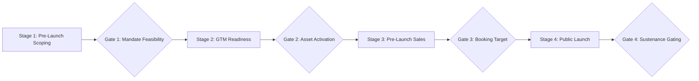

# 🎯 Strategic Pitch Assets for Sunil Mishra (CEO, Anarock Growth)
## Tailoring Your GTM, Dashboard & n8n AI Solutions for the Pitch Package

To stand out in Sunil Mishra's inbox after he accepts your connection request, you should follow up with a **highly customized, tangible Proof of Concept (PoC) package**. Rather than general resumes, you will share three proprietary-feeling assets that address Anarock's primary pain points: **Mandate GTM Execution**, **Developer Transparency**, and **Anarock.AI integration**.

Here is the exact analysis of what needs to be built, tailored from your existing ISB and n8n assets, to deliver the "Wow" factor.

---

## 🏗️ Asset 1: The "Mandate GTM" Stage-Gate Playbook

### The Pivot (From Construction to Mandate Execution):
Your current [ISB Stage-Gate Framework](file:///c:/Users/Meghana%20G%20S/OneDrive/Documents/Business%20Consulting/ISB/Week%2016/Supporting%20Documents/05_Stage_Gate_Framework.html) is built for developer-level construction (discovery, scoping, business case, superstructure completion, handover). 

For Anarock, you must pivot this to focus purely on the **sales launch and marketing mandate execution lifecycle**. Under an exclusive mandate, Anarock's financial risk lies in GTM delays, mispriced product design, and slow lead conversion.



### What You Need to Package:
A 2-page strategic document or slide set outlining these adapted stages and gates:

*   **Stage 1: Pre-Mandate Discovery & Pricing Analysis**
    *   *Deliverables:* Competitor price-volume conjoint analysis; micro-market demand heatmaps (modeled on your Bangalore studies).
    *   *Gate 1 (The Mandate Feasibility Gate):* Pass criteria: Estimated project IRR $\ge 20\%$ at blended realisations; preliminary developer expression of interest target $\ge 500$ in 6 months.
*   **Stage 2: GTM Strategy & Creative Readiness**
    *   *Deliverables:* Delineated 3-tier layout mix (barbell pricing: compact 2 BHK value tier + core premium 3 BHK + ultra-luxury signature penthouse); set up of **Anarock.AI Walk-in Genie** prompts; CP database mapping.
    *   *Gate 2 (Asset Activation Gate):* Pass criteria: Sanctioned RERA number; creative kit ready; at least **150 pre-registered CPs** in the target micro-market.
*   **Stage 3: Pre-Launch Soft Bookings**
    *   *Deliverables:* Concierge MVP testing (HNI walkthroughs at mock site); lead scoring activation using **Astra Platinum** to rank incoming interest.
    *   *Gate 3 (Booking Target Gate):* Pass criteria: Soft bookings $\ge 15\%$ of launch phase inventory; collection of at least ₹12 Cr in booking tokens.
*   **Stage 4: Public Launch & Sustenance Velocity**
    *   *Deliverables:* Launch day 360-degree digital campaigns; real-time funnel tracking; automated failed-lead routing.
    *   *Gate 4 (Sustenance Gating):* Weekly sales velocity index $\ge 12$ units/month; customer CAC maintained below 2.5% of transaction value.

---

## 📊 Asset 2: The "Developer Mandate Health" Balanced Scorecard

### The Pivot (From General Metrics to Mandate Yield):
Your current [Purva Balanced Scorecard HTML](file:///c:/Users/Meghana%20G%20S/OneDrive/Documents/Business%20Consulting/ISB/Week%2016/Supporting%20Documents/06_Balanced_Scorecard_KPIs.html) covers general project metrics (such as construction SPI, safety indices, and training hours). 

For Anarock, you must adapt this to represent a **"Client Mandate Performance Dashboard"** to showcase how you give developers complete visibility, which acts as a powerful pitching tool when Anarock pitches to new developers.

### What You Need to Package:
A clean PDF specification or mock layout showcasing 4 critical client-facing perspectives:

```
+-----------------------------------------------------------------------------------+
|                        DEVELOPER MANDATE PERFORMANCE SCORECARD                    |
+-----------------------------------------------------------------------------------+
| 1. FINANCIAL PERSPECTIVE                          2. CUSTOMER & BRAND PERSPECTIVE  |
| - Blended Revenue Realization (Target: >=8.7k/sft)| - Brand Net Promoter Score (NPS Target: >=70) |
| - Collection Efficiency (Target: >=85% on demand) | - Site-visit to Booking Conversion (>=12%)   |
| - Actual CAC vs. Budgeted Cap (Target: <=2.5% GTV)| - Lead Response Time (Target: <5 mins)        |
+-----------------------------------------------------------------------------------+
| 3. PARTNER (CP) PERSPECTIVE                       4. DIGITAL TELEMETRY & AI FUNNEL|
| - Active CP Mobilization (Target: >=200 brokers)  | - Genie AI Lead Qualification Rate (>=85%)   |
| - Top-5% CP Sales Contribution (Target: <=45%)     | - Astra Phoenix Lead Revival Rate (>=10%)    |
| - CP Ranker Accuracy Index (Target: >=90%)        | - WhatsApp Conversational Engagement CSAT(>=4)|
+-----------------------------------------------------------------------------------+
```

*   **Strategic Objective:** Demonstrates a deep understanding of mandate-level financial drivers (stabilizing CP contribution, optimizing lead conversion, and leveraging proprietary AI tools to compress customer acquisition costs).

---

## 🤖 Asset 3: The AI Lead-Revival n8n Blueprint (The "Mic-Drop" PoC)

### The Concept:
Sunil Mishra is highly proud of **Anarock.AI** (Astra and Genie). You will show him a working, importable **n8n automated workflow JSON** that serves as an external helper pipeline to their **Astra Phoenix** lead revival engine. 

This workflow automates the re-engagement of "failed/cold" leads in the CRM, routes them through a Generative AI prompt to categorize the dropout reason, and sends a highly specific WhatsApp offer to bring them back.

### The n8n JSON Configuration:
I have created a fully complete, importable n8n workflow file at:
👉 **[Anarock_AI_Revival_n8n.json](file:///c:/Users/Meghana%20G%20S/OneDrive/Documents/Business%20Consulting/Jobs/Anarock/Anarock_AI_Revival_n8n.json)**

This file contains actual node configurations:
1.  **Webhook Node:** Listens to cold/failed lead drops in the CRM.
2.  **Lead Parser Node:** Extracts the lead’s history, budget, and micro-market preference.
3.  **OpenAI GPT Prompt Node:** Categorizes the dropout reason (Price, Location, Timing) and generates a highly specific re-engagement script.
4.  **Router Node:** Splits execution based on category.
5.  **WhatsApp API Node:** Drafts the webhook request to push the revival offer.

---

## 📅 Action Plan: How to Deliver the Package

Once Sunil Mishra accepts your LinkedIn connection request, do not just send a generic message. Send your accepted nudge with this exact structure:

1.  **The Hook:** *"Thanks for connecting, Sunil! I noticed Anarock.AI is nearing ₹946 Cr in revenue, proving the success of your Astra & Genie systems."*
2.  **The Pitch:** *"Instead of a standard resume, I've compiled a brief, highly targeted GTM & AI Execution Package specifically tailored for Anarock’s developer mandates."*
3.  **The Deliverables (Attach as a single combined PDF or link):**
    *   **Page 1:** The Mandate GTM Stage-Gate Playbook (Asset 1).
    *   **Page 2:** The Developer Mandate Health Balanced Scorecard Spec (Asset 2).
    *   **Page 3:** The n8n AI Lead-Revival Blueprint schematic & JSON source (Asset 3).
4.  **The Close:** *"I’ve loaded these models based on Bangalore micro-market ticket sizes. Would love to share the live n8n pipeline setup if this level of strategy-meets-automation matches what you're building!"*
