# 🚀 Sunil Mishra (CEO, Anarock Growth) Video Conference Prep Guide
## Positioning as a Real Estate Strategist & Proptech Architect (Meghana G S, PMP®)

Congratulations! Securing a direct 30-minute Video Conference (VC) from the MD & CEO of Anarock Growth Businesses is a massive win. Sunil Mishra is a **digital-first, B2C builder and the driving force behind Anarock.AI (Genie & Astra)**. He values speed, execution, quantitative rigor, and high-level strategy that connects directly to technological automation.

To stand out for a **Strategy Role**, you must position yourself not as a traditional consultant who just builds slide decks, but as a **Real Estate Strategist + Proptech Architect** who actually designs and builds the operational systems that unlock developer margins.

---

## 🎯 1. Core Positioning Strategy

### The Strategy Persona: "The Bridge Between Proptech & Yield"
Traditional strategists understand real estate finance (IRR, cash flows) but do not understand tech. Traditional developers understand tech but do not understand ground-level sales cycles. 
* **Your Position:** You bridge this gap. You are an **ISB Alumna, PMP® professional, and proptech-literate strategist** who underwrites developer mandates using data-driven GTM Stage-Gate Playbooks, establishes absolute developer trust via real-time Balanced Scorecard metrics, and builds functional automation loops (n8n, CRM webhooks) that resurrect inactive leads to lower B2C acquisition costs.

---

## 💎 2. What Value You Bring to Anarock Growth
When Sunil asks, *"What value can you bring to my team?"*, deliver these three high-impact points:

1. **Mandate Acquisition Pitch Weapons:**
   * *The Pain Point:* Tier-1 developers are hesitant to sign exclusive mandates because they fear a lack of visibility and slow sales velocity.
   * *Your Value:* You have designed the **Developer Mandate Health Balanced Scorecard**. You will equip Anarock's business development teams with this interactive dashboard simulator, showing prospective developers that Anarock offers absolute, un-manipulable operational transparency across lead cycles, CP concentrations, and cash collections. This acts as a powerful acquisition weapon to close new developer mandates.
2. **AI-Driven CAC Compression:**
   * *The Pain Point:* Digital ad spends are inflating, eroding sales margins. 
   * *Your Value:* You do not just preach AI; you build the pipelines. By integrating conversational AI (like **Walk-in Genie**) and automated webhook-based re-engagement engines (like **Astra Phoenix / n8n**), you prove how to salvage cold leads, compressing B2C lead acquisition costs and boosting database yields.
3. **Execution Rigor (Stage-Gate Governance):**
   * *The Pain Point:* Launching a mandate involves hundreds of parallel streams (RERA, creative assets, CP mobilization, pre-sales). A delay in any stream leaks money.
   * *Your Value:* Using your PMP® background, you have formulated a **Mandate GTM Stage-Gate Playbook** tailored to real estate sales. It enforces structured decision gates (Gates 1–4) with exact compliance metrics (e.g. Sales Velocity Index $\ge 12$ units/month, CP mobilization $\ge 150$), ensuring Anarock launches are launched on schedule with zero cost leakage.

---

## 🗓️ 3. The 30-Minute VC Agenda & Roadmap
With only 30 minutes, you must be surgical. Treat this as a collaborative working session, not an interrogation.

```mermaid
gantt
    title 30-Minute VC Meeting Roadmap
    dateFormat  X
    axisFormat %H:%M
    
    section Conversation
    Strategic Alignment & Hook :active, 0, 7
    The Core Asset Walkthrough  :crit, 7, 22
    The Hiring Pitch & Value Prop: 22, 27
    Q&A and Next Steps         : 27, 30
```

### ⏱️ Phase 1: The Strategic Hook (0:00 – 0:07)
* **Goal:** Align with Sunil's vision and set the agenda.
* **Your Script:** 
  > *"Sunil, thank you for the time. I've been following what you are building with Anarock.AI. Astra and Genie are changing the game in B2C proptech. In my consulting work with Tier-1 developers, I’ve realized that traditional developer metrics stop at construction milestones (SPI, concrete pouring). But developer yield is actually driven entirely by GTM velocity, CP mobilization, and digital CAC compression.* 
  >
  > *Instead of taking you through a generic resume, I’ve built a custom GTM and AI proof-of-concept package specifically tailored to Anarock’s developer mandates. I'd love to share my screen for 10 minutes and show you the assets."*

### 💻 Phase 2: The Screencast & Asset Walkthrough (0:07 – 0:22)
Open your live URL: **[https://buildbusinessdigitalmeg-ux.github.io/anarock-pitch-assets/](https://buildbusinessdigitalmeg-ux.github.io/anarock-pitch-assets/)** and take him through the three pillars:

#### Pillar A: The "Mandate GTM" Stage-Gate Playbook (5 mins)
* **Focus:** Show the transition from construction to sales governance.
* **Key Point:** 
  > *"We pivoted the standard Cooper Stage-Gate framework to focus purely on the exclusive mandate sales launch lifecycle. In Stage 2, RERA issues and CP database registration act as the hard gate. In Stage 4, if lead CAC climbs above 2.5%, the playbook triggers automated pricing adjustments or shifts ad spend to AI lead-revival pipelines to lower CPA."*
* **Action:** Play with the **Interactive Gate Simulator** live on the screen to show how adjusting sft realizations, CP registration, and CAC immediately flags gate compliance.

#### Pillar B: The Mandate Balanced Scorecard Dashboard (5 mins)
* **Focus:** Show how this dashboard acts as a B2B sales pitch tool.
* **Key Point:** 
  > *"When Anarock pitches to a premium developer, we don't just promise sales; we show them this dashboard. It integrates four core perspectives—Financial, Customer, Partner (CP), and Digital Telemetry. It features a master Radar Index in the header to capture overall mandate health. It proves to developers that we underwrite their success transparently."*
* **Action:** Toggle through the simulated dashboard pages (Page 1 Executive Overview, Page 2 CP Concentration Lorenz curve, Page 3 Genie funnel bar chart) to show how responsive and live the telemetry is.

#### Pillar C: The Astra Phoenix / n8n AI Lead-Revival Loop (5 mins)
* **Focus:** Establish your hands-on technical capabilities.
* **Key Point:** 
  > *"Sunil, I saw your focus on Astra Phoenix. I built a functional helper automation workflow in n8n. The moment a lead goes cold in the CRM, it fires a webhook to n8n, passes the historical data through GPT-4o to categorize the dropout reason (Budget, Timing, Location), drafts a hyper-personalized WhatsApp re-engagement offer, and fires it via the WhatsApp API. This bypasses human sales overhead and recovers 11.4% of dead pipeline."*
* **Action:** Briefly show the node schematic of the workflow or play a snippet of your walkthrough video.

### 💼 Phase 3: The Hiring Pitch & Value Prop (0:22 – 0:27)
* **Goal:** Pivot to how you fit into his organization.
* **Your Script:**
  > *"I want to bring this strategy-meets-execution rigor to Anarock Growth. I can immediately step in to lead mandate underwriting, optimize digital marketing yields across your micro-markets, and work directly with your product teams to expand Anarock.AI integrations. I'm ready to own the sales velocity on your Tier-1 mandates."*

### 🤝 Phase 4: Q&A and Next Steps (0:27 – 0:30)
* **Goal:** Lock in the next round.
* **Action:** Thank him, ask for feedback on the assets, and align on an in-person meeting or technical presentation with his leadership team (Shweta Papriwal and Dr. Prashant Thakur).

---

## 💡 4. Potential "GRILL" Questions & How to Answer Them

> [!WARNING]
> **Q: "This looks great, but isn't database re-activation hard because of WhatsApp spam rules?"**
> * **A:** *"Absolutely. That’s why the n8n blueprint uses LLM profiling first. We do not blast the database. The AI evaluates the exact reason they dropped out, generates a highly specific, high-utility offer (like a compact barbell option or developer subvention scheme), and limits the outreach. High utility, zero spam."*

> [!IMPORTANT]
> **Q: "Developers are often stubborn about pricing. How does the Barbell Pricing model help in negotiation?"**
> * **A:** *"Developers think in straight averages (e.g. ₹10,000/sft across all units). Our Stage 2 Barbell calculator shows them that by splitting the layout into a high-volume Compact Value tier (to speed up cash inflows and CP momentum) and an ultra-luxury Signature Penthouse tier, we protect their overall sft average while accelerating initial absorption velocity by 30%."*

> [!TIP]
> **Q: "What makes your Stage-Gate Playbook different from standard project management?"**
> * **A:** *"Traditional project management is calendar-driven (we do tasks on dates). Stage-Gate is risk-driven (we do not spend money on Stage 3 until Gate 2 criteria are 100% verified, such as CP mobilization and RERA approval). It enforces financial discipline."*

---

## 📧 5. Draft Email to Sunil Mishra (Send Immediately to Book the Time)

**Subject:** GTM Playbook & AI Assets / Meghana Grama Satyan (ISB Alumna)

Dear Sunil,

Thank you for accepting my connection request on LinkedIn. As requested, I am writing to schedule our video conference for next week.

To help you get context before our meeting, I have hosted my portfolio hub featuring the custom **GTM Stage-Gate Playbook**, the **Developer Mandate Balanced Scorecard (with interactive Chart.js widgets)**, and the **n8n Lead-Revival AI blueprint** at the link below:

👉 **Strategic Mandate Hub:** https://buildbusinessdigitalmeg-ux.github.io/anarock-pitch-assets/

I have structured these assets around Bangalore micro-market ticket sizes to demonstrate how we can pitch and govern exclusive developer mandates while compressing CAC using the proprietary **Anarock.AI** framework.

Please let me know your availability for a 30-minute video conference next week (I am flexible, but **Tuesday or Wednesday afternoon** works exceptionally well on my end). 

Looking forward to our conversation!

Warm regards,

**Meghana Grama Satyan**  
ISB Alumna & Real Estate Strategist  
PMP® Certified  
📞 [Your Phone Number]  
🔗 [LinkedIn Profile]  
